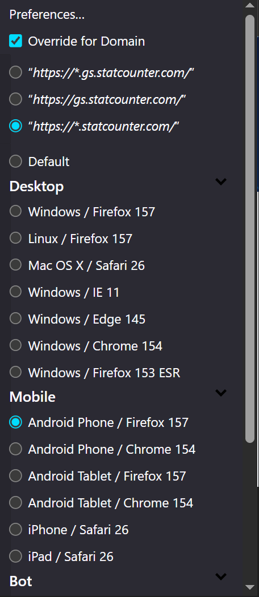
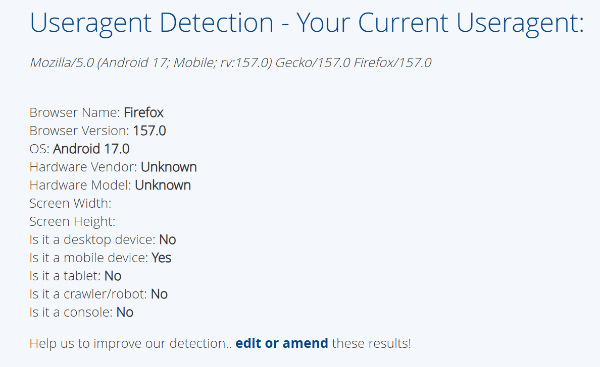

# User-Agent Switcher — Chrome port

An **unofficial Manifest V3 port** of [ntninja's *User-Agent Switcher*](https://gitlab.com/ntninja/user-agent-switcher)
(originally a Firefox WebExtension). It overrides the `User-Agent` request
header and the page-visible `navigator.*` values, globally or per site, and
keeps the original popup, options page, random-rotation mode and translation
catalogue.

## Original project (Firefox)

This port is based on the upstream Firefox add-on, which remains the canonical
version:

- **Source code:** https://gitlab.com/ntninja/user-agent-switcher
- **Firefox add-on:** https://addons.mozilla.org/firefox/addon/uaswitcher/
  (also available for Firefox for Android)

This repository is an independent Chrome adaptation. It is not published on the
Chrome Web Store — install it as an unpacked extension (see below).

## Install in Chrome (locally)

This extension is **not on the Chrome Web Store**; it is installed as an
**unpacked** extension. Chrome loads the folder that contains `manifest.json`
directly — the built ZIP is an archive for releases/uploads, **not** an
installer.

### From source (development)

1. Initialise the submodules first — the runtime needs
   `deps/public-suffix-list/dist/psl.js` and `deps/wext-options/options.js`:
   ```sh
   git submodule update --init --recursive   # or: npm run submodules
   ```
2. Open `chrome://extensions` in the address bar.
3. Toggle **Developer mode** on (top-right corner).
4. Click **Load unpacked** and select the root of this repository (the folder
   that has `manifest.json`).
5. The extension appears in the list. Pin it through the puzzle-piece toolbar
   menu to reach the **popup**; the **options page** opens from the popup (the
   gear icon) or from the extension's details on `chrome://extensions`.

Chrome reports any installation error directly on the extension's card there.

### From a release ZIP

1. Download `user-agent-switcher-chrome-<version>.zip` from the
   [Releases](https://github.com/depler/user-agent-switcher-chrome/releases)
   page — or produce it yourself with `npm run build`.
2. Extract the ZIP into a folder; `manifest.json` must end up at the root of
   the extracted folder.
3. Follow steps 2–5 above, pointing **Load unpacked** at that extracted folder.

> Chrome cannot install the ZIP directly — it is not a signed store package.
> Off-store `.crx` installs are blocked outside enterprise policy, so
> **Load unpacked** is the supported way to run this build.

### After changing the code

Press the reload (⟳) button on the extension's card in `chrome://extensions`
so the service worker and the declarativeNetRequest rule set are rebuilt.

### Verify that it works

- the **request header**: open
  https://www.whatismybrowser.com/detect/what-is-my-user-agent/ and check the
  reported User-Agent;
- the **JavaScript value**: open DevTools → Console and evaluate
  `navigator.userAgent`.

## Screenshots

| Popup — pick a User-Agent and an override scope | Result — the spoofed UA on a detection site |
| --- | --- |
|  |  |

## What changed compared to the Firefox original

The original relied on several Firefox-only APIs. The port keeps the shared
code (`utils/*`, matching engine, BrowsCap parser, presets, i18n, popup
scripts) almost verbatim and replaces only the pieces that cannot work in
Chrome.

| Firefox original | Chrome port |
| --- | --- |
| `manifest_version: 2` | `manifest_version: 3` (service worker, `action`) |
| Blocking `browser.webRequest.onBeforeSendHeaders` | `chrome.declarativeNetRequest` `modifyHeaders` rules (`background/dnr.js`) |
| `browser.contentScripts.register()` with inline code | `chrome.scripting.registerContentScripts()` with a `world: "MAIN"` file |
| Firefox Xray (`wrappedJSObject`/`cloneInto`/`exportFunction`) navigator patching | Plain prototype-level getters in `content/navigator-override.js` |
| `browser.browserAction.*` | `chrome.action.*` (PNG icons rasterized from the original SVGs) |
| `window.setTimeout` for timed random rotation | `chrome.alarms` (survives service-worker termination) |
| `browser.theme` / `getBrowserInfo` | removed |
| `browser_style: true` styling | `ui/common/browser-style.css` re-implements the used subset |
| Firefox-only `console.exception` | shimmed in `utils/polyfill.js` |
| locales using an undeclared `$HOSTNAME$` placeholder | `placeholders` added (Chrome rejects undefined placeholders) |

`webextension-polyfill` is bundled (`deps/browser-polyfill.js`) so that the
shared code can keep using the Firefox-style promise-based `browser.*` API.

## How navigator spoofing works

A `MAIN` world content script cannot call any extension API, and a page's
inline scripts may run before an asynchronous `chrome.storage` read
completes. The port therefore smuggles the per-document navigator data-set to
the page through a `Server-Timing` **response header** that the
service worker attaches with `declarativeNetRequest`
(`background/dnr.js` → `content/navigator-override.js` reads it back
synchronously from `performance.getEntriesByType("navigation")` at
`document_start`). The marker is filtered out of the Performance Timeline
again after it has been consumed.

## Known differences / limitations

- **Client Hints.** `navigator.userAgentData` is hidden when spoofing a
  non-Chromium browser, but not re-generated for Chromium spoofs.
- **Ports.** `declarativeNetRequest` has no port-matching condition, so
  overrides ignore the (rarely used) port part of a pattern. Exact-host vs.
  sub-domain-wildcard also collapse into "domain + sub-domains".
- **Frames without a network response** (`about:blank`, `srcdoc`) do not
  receive the `Server-Timing` payload, so their `navigator` is not
  overridden.
- `Server-Timing` is *set* (not appended) on documents, replacing any value
  the server sent.

## Dependencies (git submodules)

Third-party sources are wired up as git submodules under `deps/` — the same
model the original project uses:

- `deps/browscap/browscap-js` + `deps/browscap/{md5,charenc,crypt,is-buffer,synchronous-promise}` — sources for the BrowsCap bundle
- `deps/public-suffix-list` — used in place (`dist/psl.js`)
- `deps/wext-options` — used in place (`options.js` / `options.css`)
- `deps/webextension-polyfill` — source for the committed `deps/browser-polyfill.js`

Because upstream does not ship the artifacts in the form the extension needs,
they are committed in this repository (just like the original commits its
`browscap.js` bundle and BrowsCap JSON cache):

- `deps/browscap.js` — browserify bundle, rebuilt with `deps/update-browscap.sh`
- `deps/browser-polyfill.js` — rebuilt with `deps/update-browser-polyfill.sh`
- `deps/browscap-json-cache-files/` — generated BrowsCap data

Clone with submodules, or initialise them in an existing checkout:

```sh
git clone --recurse-submodules <repo>
git submodule update --init --recursive   # existing checkout
```

## Development

```sh
npm install          # install dev tooling (TypeScript, ESLint, Chrome typings)

npm run typecheck    # tsc -p jsconfig.json  (checkJs + strict)
npm run lint         # eslint .
npm test             # CDP smoke test (see below)
npm run build        # package dist/user-agent-switcher-chrome-<version>.zip
npm run icons        # rasterize assets/*.svg -> assets/icons/*.png
```

The type-checking and lint configuration mirrors the Firefox original
(`jsconfig.json` with `checkJs`/`strict`, `.eslintrc.json`), extended with
`@types/chrome` for the Manifest V3 APIs and a small `types/globals.d.ts`
shim.

### Running the smoke test

`npm test` drives a real browser over the DevTools protocol. Chromium's
branded builds refuse `--load-extension`, so point the test at a build that
allows it (e.g. Chrome for Testing):

```sh
npm run browser:install                    # fetch Chrome for Testing
UASW_CHROME=<path-to-chrome> npm test
```

If you already have a browser running with the extension loaded and remote
debugging enabled, connect to it instead:

```sh
UASW_CDP_PORT=9222 npm test
```


## License

Same as the original: GPL-3.0-or-later. See `LICENSE.md`.
The bundled `deps/*` components keep their own licenses.
